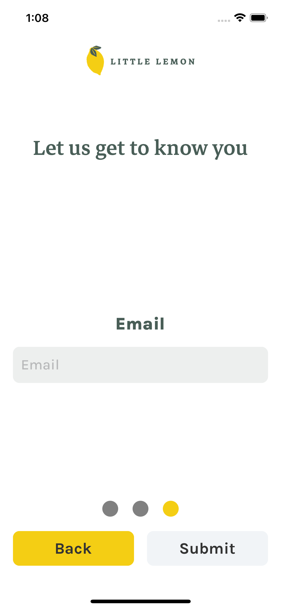
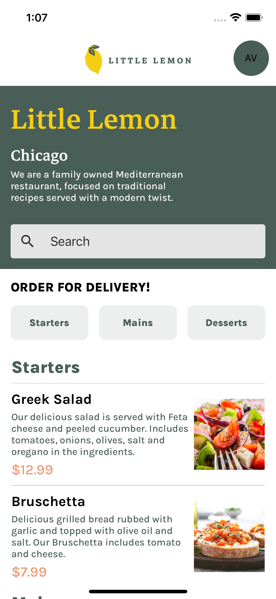
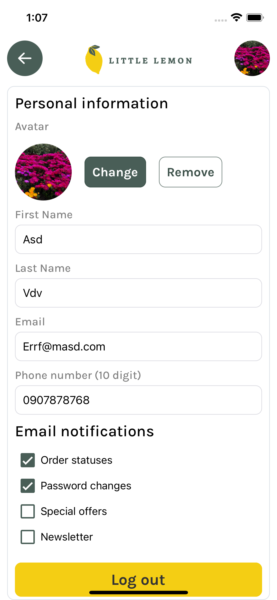

# Capstone App
Capstone App is a mobile application built with Expo React Native. 

This repository contains the source code for the app.

# Snack Demo
A Snack Expo demo of the Capstone RN can be found [here](https://snack.expo.dev/@jul.dev/capstone-rn-meta?platform=android).

## Preview
[](onboarding-email.png)
[](home.png)
[](profile.png)
# Installation
Before you begin, ensure that you have the following installed on your machine:

- Node.js
- Expo CLI

To get started, clone this repository and navigate to the project directory:


```$ git clone https://github.com/M-Julius/capstone-rn.git```

```$ cd capstone-rn```

Install the dependencies:

```$ yarn install```

Usage
To run the app, use the Expo CLI:

```$ expo start```

This will start the development server and open the Expo developer tools in your browser. 
